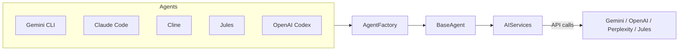

# EUFM System Architecture and Developer Guide

This document provides a high-level overview of the EUFM Assistant's architecture and guidance for contributing new components.

## Overview of AI Agents

The EUFM ecosystem coordinates multiple AI agents, each optimized for different tasks:

- **Gemini CLI** – primary command-line agent for executing development and automation tasks.
- **Claude Code** – assists with code generation and review.
- **Cline** – orchestration layer that coordinates other agents and system tasks.
- **Jules** – research-focused agent for knowledge gathering.
- **OpenAI Codex** – language model used for code completion and generation.

These agents communicate through a shared service layer and follow a common interface defined by `BaseAgent`.



## Directory Structure

```
eufm/
└── app/
    ├── api/        # REST API endpoints
    ├── models/     # Data models and schemas
    ├── services/   # Business logic (AgentFactory, task router)
    ├── agents/     # Implementations of BaseAgent derivatives
    └── utils/      # Shared utilities (ai_services, logging helpers)
```

## Configuration with Pydantic Settings

Configuration is centralized in [`config/settings.py`](../config/settings.py), which uses **Pydantic BaseSettings** to load environment variables and project paths. The `Settings` object exposes application (`app`) and AI service (`ai`) configurations:

```python
from config.settings import get_settings
settings = get_settings()
print(settings.ai.default_model)
```

## AI Services Abstraction

The [`app/utils/ai_services.py`](../app/utils/ai_services.py) module provides a unified interface for interacting with external AI providers (Gemini, OpenAI Codex, Perplexity Sonar, etc.). All agents depend on this module instead of calling provider SDKs directly, which simplifies provider switching and testing.

## BaseAgent and AgentFactory Pattern

All agents inherit from [`BaseAgent`](../app/agents/base_agent.py), which defines standard lifecycle hooks (`run`, `on_start`, `on_success`, `on_failure`). Agents are instantiated through the [`AgentFactory`](../app/services/agent_factory.py), ensuring consistent configuration and dependency injection (notably `AIServices`).

## Centralized Logging and Error Handling

Each agent and service uses Python's `logging` module, allowing logs to be routed to files or monitoring systems. Custom exceptions in [`app/exceptions.py`](../app/exceptions.py) standardize error reporting across the system, providing structured messages for API consumers and debugging.

## Extending the System

### Adding a New AI Provider
1. **Update Settings:** Add API keys or configuration options in `config/settings.py`.
2. **Extend AIServices:** Implement a new method in `app/utils/ai_services.py` that wraps the provider's SDK.
3. **Use in Agents:** Inject the new service through `AgentFactory` and call it from agent implementations.

### Creating a New Agent
1. **Subclass `BaseAgent`:** Place the new agent in `app/agents/` and implement the `run` method.
2. **Register with `AgentFactory`:** Update the registry in `app/services/agent_factory.py` with a key and class reference.
3. **Leverage AIServices:** Use the centralized `AIServices` instance for provider interactions.
4. **Handle Errors and Logging:** Utilize the logging framework and raise custom exceptions where appropriate.

Following this pattern keeps the architecture modular and maintainable.
